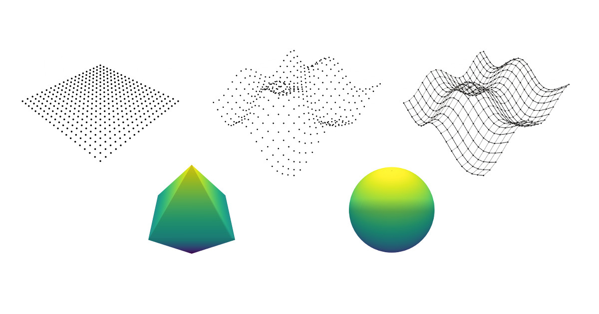

# Graphing the p-Norm Unit Ball in 3 Dimensions

How to graph a sphere, a cube, an octahedron, and every continuous shape in between with one function.

[View Live](https://mimmackk.github.io/unitball/)

